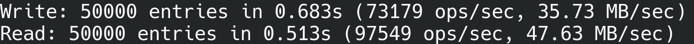

# lithos



lithos is a high performance, persistent log-structured merge-tree (lsm) key-value engine written in c. it is a lightweight, zero dependency alternative to leveldb/rocksdb for embedded linux deployments that still provides acide-like durability, snapshot isolation (mvcc), and crash consistency without a c++ runtime. cli `bench` (50k ops, 512b values) on dev hardware sustains ~73k writes/sec and ~97k reads/sec.

_For a deep dive into databases, head over to [this blog](https://bit2-blog.vercel.app/posts/lithos-deep-dive) of mine._

## why lithos
- small, predictable footprint: only `libc` and `pthread` are required.
- fast write path: memtable + wal with leveled compaction to ssts.
- mvcc reads: snapshots give repeatable reads without blocking writers.
- strict durability: wal-first writes and manifest-backed versioning.
- corruption visibility: block checksums are verified on read; errors surface, not hidden.
- sequence recovery: sequence numbers persist in sst metadata and are restored on db open.

## capabilities at a glance
| area | what you get |
| --- | --- |
| write path | wal -> memtable (skiplist) -> immutable memtable -> leveled ssts |
| read path | memtable, imm memtable, then table cache with bloom filters and block cache |
| compression | rle and prefix compression inside data blocks |
| integrity | crc32c on wal records and sst blocks |
| concurrency | single writer under `db->mu`, lock-free reads via snapshots |
| maintenance | background compaction, at most one bg thread, joined cleanly |

## architecture overview
- wal: every mutation is appended before it becomes visible.
- memtable: skiplist backed by an 8-byte-aligned arena; swaps to `imm` on flush.
- ssts: level-0 may overlap; higher levels are disjoint, sorted ranges.
- manifest + versionset: manifest is the source of truth; file metadata is refcounted and released on every path (success or failure).
- caches: table cache for open readers; block cache for data blocks.

## build and install
```bash
# build library and tools
make all

# run unit tests
make test

# sanitizer build (asan/ubsan) and binaries
make sanitize

# install static lib and headers (requires sudo)
sudo make install
```

## cli quickstart
```bash
# put and get
./build/bin/lithos_cli /tmp/lithosdb put user:100 "alice"
./build/bin/lithos_cli /tmp/lithosdb get user:100

# scan
./build/bin/lithos_cli /tmp/lithosdb scan

# benchmark (count value_size)
./build/bin/lithos_cli /tmp/lithosdb bench 500000 128
```

## c api in one page
```c
#include "lithos.h"
#include <stdio.h>
#include <stdlib.h>

int main(void) {
    Lithos_DB* db = NULL;
    Lithos_Options opt;
    Lithos_Options_InitDefault(&opt);

    Status s = Lithos_Open("/tmp/lithosdb", &opt, &db);
    if (!Status_IsOK(s)) {
        fprintf(stderr, "open failed: %s\n", Status_ToString(s));
        Status_Free(s);
        return 1;
    }

    s = Lithos_Put(db, "key1", "value1");
    if (!Status_IsOK(s)) {
        fprintf(stderr, "put failed: %s\n", Status_ToString(s));
        Status_Free(s);
        Lithos_Close(db);
        return 1;
    }

    char* val = NULL;
    s = Lithos_Get(db, "key1", NULL, &val);
    if (Status_IsOK(s) && val) {
        printf("found: %s\n", val);
        Lithos_Free(val);
    }
    Status_Free(s);

    Lithos_Close(db);
    return 0;
}
```

## qa and operations
- unit tests: `make test` (thousands of assertions across wal, memtable, table, cache, db).
- stress (sanitized): `make sanitize && ./build/bin/lithos_stress /tmp/lithos-stress`.
- fuzz (sanitized): `./build/bin/lithos_fuzz /tmp/lithos-fuzz` reports corruption on injected sst bit flips with zero leaks.
- valgrind smoke: `valgrind --leak-check=full ./build/bin/lithos_cli /tmp/leak_db fill 1000 128`.

## documentation
- architecture deep-dive: [docs/architecture.md](docs/ARCHITECTURE.md)
- design invariants: [docs/design_invariants.md](docs/DESIGN_INVARIANTS.md)
- formatting guide: [docs/format.md](docs/FORMAT.md)
- product requirements: [docs/prd.md](docs/PRD.md)
- changelog: [CHANGELOG.md](CHANGELOG.md)

## contribution guidelines
- keep invariants intact: refcounts on `filemetadata` and memtables must balance on success and failure paths.
- iterator ownership: merge iterators own their children; do not destroy children after passing to a merge iterator.
- internal key format: tests must use internal keys (user key + 8-byte trailer) when calling low-level table apis.
- prefer small, single-purpose changes; include tests for new behavior.
- run `make format` and `make test` (or `make sanitize` for deeper checks) before sending a patch.

## license
mit.
