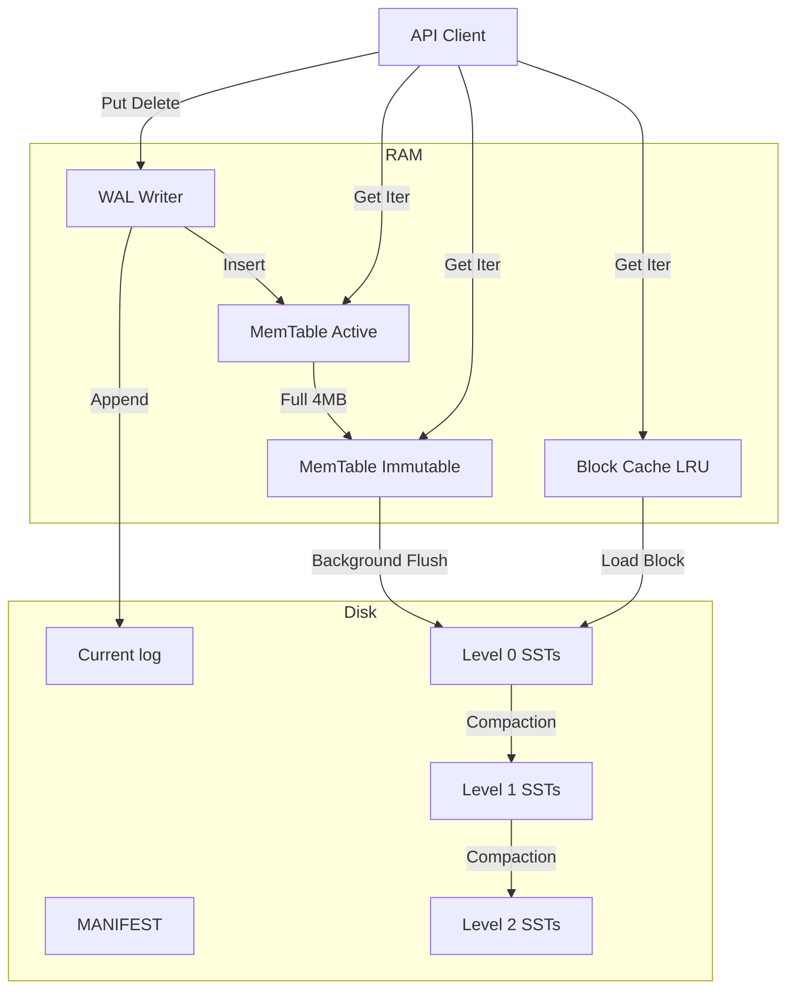

# Master Design Specification: Lithos Storage Engine (v2.0)

| Meta Field | Value |
| --- | --- |
| **Project Name** | **Lithos** |
| **Version** | **2.0.0** |
| **Author** | Aditya (`@bit2swaz`) |
| **Status** | **DRAFT** |
| **Language** | **C11 (ISO/IEC 9899:2011)** |
| **Dependencies** | `libc`, `pthread` (POSIX Threads) |
| **Endianness** | **Little Endian** (Strict) |
| **Concurrency** | **MVCC** (Multi-Version Concurrency Control) |
| **Architecture** | **LSM-Tree** (Log-Structured Merge Tree) |

---

## 1. Executive Summary

**Lithos** is a persistent, thread-safe, high-performance Key-Value storage engine embedded as a C library. It is designed to replace LevelDB/RocksDB in environments requiring strict resource control and zero C++ runtime overhead.

### 1.1 Design Goals

1. **High Write Throughput:** >100k ops/sec via sequential I/O (LSM Architecture).
2. **Snapshot Isolation:** Readers never block writers; writers never block readers.
3. **Crash Consistency:** ACID guarantees via Write-Ahead Log (WAL).
4. **Resource Bounded:** Memory usage is strictly capped via Arena allocators and LRU Caches.

---

## 2. System Architecture

The engine functions as a **pipelined state machine**. Data flows from volatile RAM buffers to immutable disk files through a series of transformations.

### 2.1 High-Level Diagram



---

## 3. Core Subsystems & Data Structures

### 3.1 Memory Management: The Arena

To prevent memory fragmentation and overhead from millions of `malloc` calls for small nodes, Lithos uses an **Arena Allocator**.

* **Concept:** Allocate memory in large "Blocks" (e.g., 4KB). Distribute pointers from inside these blocks.
* **Deallocation:** No individual `free()`. The entire Arena is destroyed when the MemTable is flushed.
* **Struct Definition:**
```c
typedef struct {
    char* ptr;             // Current write pointer in the active block
    size_t remaining;       // Bytes left in the active block
    void** blocks;          // Array of allocated block pointers
    size_t block_count;     // Total blocks allocated
    size_t memory_usage;    // Total tracked usage via atomic counter
} Arena;

```


* **Optimization:** Pointers are aligned to 8-byte boundaries to prevent unaligned access faults on ARM/x86.

### 3.2 The MemTable (Skip List)

* **Structure:** Multilevel Linked List (Skip List).
* **Concurrency:**
* **Writes:** Protected by `db_mutex`. Single writer.
* **Reads:** Lock-free. Nodes are inserted with `atomic_store_explicit` (memory_order_release).


* **Key Format:** Internal Key = `UserKey` + `SequenceNumber` + `Type`.
* *Rationale:* This allows multiple versions of the same key to coexist.


### 3.3 The VersionSet (MVCC & Metadata)

Tracks the "Truth" of the database at any point in time.

* **Reference Counting:** A `Version` contains a list of all live SSTables.
* **Lifecycle:**
1. New `Compaction` or `Flush` creates a new `Version`.
2. The global `CurrentVersion` pointer is updated atomically.
3. Old `Versions` are kept alive as long as an active Iterator is reading them.
4. When ref-count hits 0, the old `Version` is destroyed and obsolete files are deleted.


---

## 4. Disk Format Specifications

All integers are **Little Endian**.
**Varint64:** Variable-length integers (Protobuf style) are used for lengths to save space.

### 4.1 Write-Ahead Log (WAL)

A sequence of 32KB blocks. If a record doesn't fit, it is fragmented across blocks.

**Record Format:**

```text
[Checksum (4B)] [Length (2B)] [Type (1B)] [Payload (N Bytes)]

```

* `Checksum`: CRC32 of Type + Payload.
* `Type`:
* `1`: FULL (Record fits in block)
* `2`: FIRST (Start of fragmented record)
* `3`: MIDDLE (Middle of fragmented record)
* `4`: LAST (End of fragmented record)


### 4.2 SSTable (Sorted String Table) v3

Based on the RocksDB Block-Based format.

**File Layout:**

```text
[Data Block 0]
[Data Block 1]
...
[Filter Block]  (Bloom Filter)
[Meta Index Block]
[Index Block]
[Footer]

```

**A. Data Block Format (Prefix Compressed):**
To save space, keys share prefixes with the previous key.

```text
[SharedLen (Varint)] [NonSharedLen (Varint)] [ValLen (Varint)] [KeySuffix] [Value]

```

* *Example:*
* Key 1: "drive" -> Shared: 0, NonShared: 5, Val: ...
* Key 2: "driver" -> Shared: 5, NonShared: 1, Suffix: "r", Val: ...


**B. Filter Block (Bloom Filter):**

* Generates a Bloom Filter for every 2KB of data.
* Allows checking `Does Key X exist in Data Block Y?` without reading the data block.

**C. Footer (Fixed 48 Bytes):**
Contains the "Magic Number" and offsets to the Meta/Index blocks.

```c
struct Footer {
    uint64_t metaindex_handle_offset;
    uint64_t metaindex_handle_size;
    uint64_t index_handle_offset;
    uint64_t index_handle_size;
    uint32_t magic_lo; // 0x50e5022e
    uint32_t magic_hi; // 0x8b432a61
};

```

---

## 5. Subsystem Logic

### 5.1 Compaction (Leveled)

The heart of the LSM tree. Keeps read speeds fast by removing deleted data and merging files.

**Levels:**

* **L0:** Created by Flush. Keys **can** overlap between files.
* **L1 - L6:** Keys **cannot** overlap. Sorted disjoint ranges.

**The Algorithm (Background Thread):**

1. **Trigger:**
* L0 has > 4 files.
* OR Li size > (10^i) MB.


2. **Pick:** Select file `f` from Level `i` with the largest overlap range.
3. **Scan:** Find all files in Level `i+1` that overlap with `f`'s key range.
4. **Merge:**
* Open iterators for all inputs.
* Perform K-Way Merge Sort.
* Discard keys overwritten by newer Sequence Numbers.
* Discard "Tombstones" (Deletes) *only if* the key doesn't exist in higher levels.


5. **Output:** Write new SSTables to Level `i+1`.
6. **Commit:** Atomic `MANIFEST` update. Delete old files.

### 5.2 Block Cache (Sharded LRU)

* **Sharding:** The cache is split into 16 shards based on `Hash(Key) % 16`.
* **Benefit:** Reduces mutex contention. 16 threads can access the cache simultaneously.
* **Lookup:**
1. Construct Key: `FileID + Offset`.
2. Hash Key -> Select Shard.
3. Lock Shard Mutex.
4. Check Hash Map.
5. On Hit: Move node to front of LRU list. Bump RefCount.
6. On Miss: Read from disk, insert into Cache.


---

## 6. Public API Specification (`lithos.h`)

This is the contract for the user (Aether).

```c
#ifndef LITHOS_H
#define LITHOS_H

#include <stdint.h>
#include <stddef.h>

#ifdef __cplusplus
extern "C" {
#endif

// --- Opaque Types ---
typedef struct lithos_db_t lithos_db_t;
typedef struct lithos_writebatch_t lithos_writebatch_t;
typedef struct lithos_iterator_t lithos_iterator_t;
typedef struct lithos_snapshot_t lithos_snapshot_t;

// --- Status Codes ---
typedef enum {
    LITHOS_OK = 0,
    LITHOS_NOT_FOUND = 1,
    LITHOS_CORRUPTION = 2,
    LITHOS_IO_ERROR = 3,
    LITHOS_INVALID_ARGUMENT = 4
} lithos_status;

// --- Options ---
typedef struct {
    int create_if_missing;
    int error_if_exists;
    int paranoid_checks;
    size_t write_buffer_size;     // Default: 4MB
    size_t max_open_files;        // Default: 1000
    size_t block_cache_size;      // Default: 8MB
    const char* info_log;         // Path to log file
} lithos_options_t;

// --- Database Management ---
lithos_status lithos_open(const lithos_options_t* options, const char* name, lithos_db_t** db);
void lithos_close(lithos_db_t* db);
void lithos_destroy_db(const char* name, const lithos_options_t* options);

// --- Atomic Updates ---
lithos_writebatch_t* lithos_writebatch_create();
void lithos_writebatch_destroy(lithos_writebatch_t* batch);
void lithos_writebatch_put(lithos_writebatch_t* batch, const char* key, size_t klen, const char* val, size_t vlen);
void lithos_writebatch_delete(lithos_writebatch_t* batch, const char* key, size_t klen);
void lithos_writebatch_clear(lithos_writebatch_t* batch);

lithos_status lithos_write(lithos_db_t* db, const lithos_options_t* options, lithos_writebatch_t* batch);

// --- Reads & Snapshots ---
const lithos_snapshot_t* lithos_create_snapshot(lithos_db_t* db);
void lithos_release_snapshot(lithos_db_t* db, const lithos_snapshot_t* snapshot);

lithos_status lithos_get(lithos_db_t* db, const lithos_options_t* options, 
                         const char* key, size_t klen, 
                         char** value, size_t* vlen); // Caller frees value

// --- Iteration ---
lithos_iterator_t* lithos_create_iterator(lithos_db_t* db, const lithos_options_t* options);
void lithos_iter_destroy(lithos_iterator_t* iter);
void lithos_iter_seek_to_first(lithos_iterator_t* iter);
void lithos_iter_seek_to_last(lithos_iterator_t* iter);
void lithos_iter_seek(lithos_iterator_t* iter, const char* target, size_t klen);
void lithos_iter_next(lithos_iterator_t* iter);
void lithos_iter_prev(lithos_iterator_t* iter);
int lithos_iter_valid(lithos_iterator_t* iter);
const char* lithos_iter_key(lithos_iterator_t* iter, size_t* klen);
const char* lithos_iter_value(lithos_iterator_t* iter, size_t* vlen);

#ifdef __cplusplus
}
#endif

#endif // LITHOS_H

```

---

## 7. Implementation Roadmap

### Phase 1: The Core Utilities (Weeks 1-3)

* Implement `Arena` allocator.
* Implement `Coding` (Varint32/64, Fixed32/64 encoding).
* Implement `CRC32C` with hardware acceleration checks.
* Implement `Slice` (a pointer + length string wrapper).

### Phase 2: The In-Memory Engine (Weeks 4-6)

* Implement `SkipList` using the Arena.
* Implement `MemTable` wrapping the SkipList with Reference Counting.
* **Test:** Concurrent inserts + Single thread reads.

### Phase 3: The Persistent Log (Weeks 7-8)

* Implement `WriteBatch` serialization.
* Implement `LogWriter` and `LogReader`.
* **Test:** Write data -> Crash -> Recover from Log -> Verify MemTable.

### Phase 4: SSTables & Block Cache (Weeks 9-12)

* Implement `TableBuilder` (Writes SST files).
* Implement `TableReader` (Reads SST files with binary search).
* Implement `LRUCache`.

### Phase 5: VersionSet & Manifest (Weeks 13-16)

* Implement `VersionEdit` serialization.
* Implement `VersionSet` logic (tracking live files).
* Implement `MANIFEST` logging.

### Phase 6: Compaction & Threading (Weeks 17-20)

* Implement `DBImpl` (The main class).
* Implement Background Thread pool.
* Implement the `Compaction` logic (L0 -> L1 merge).

---

## 8. Verification Strategy

We do not trust; we verify.

### 8.1 The "Crash" Test

A script that:

1. Starts the DB.
2. Writes 10,000 keys asynchronously.
3. Sends `kill -9` (SIGKILL) to the process at a random millisecond.
4. Restarts the DB.
5. Verifies strict consistency (No missing confirmed writes, no partial writes).

### 8.2 The "Torture" Test

1. Run 10 Writer Threads (Random Put/Delete).
2. Run 10 Reader Threads (Random Get).
3. Run 2 Iterator Threads (Full Scan).
4. **Duration:** 24 Hours.
5. **Pass Condition:** Zero Segfaults, Zero Data Corruption errors.

---

## 9. Future Extensions (v2.1+)

* **Compression:** Snappy/Zstd block compression.
* **Filter Policy:** Bits-per-key tuning.
* **Direct I/O:** Bypassing OS Page Cache (`O_DIRECT`) for NVMe optimization.
