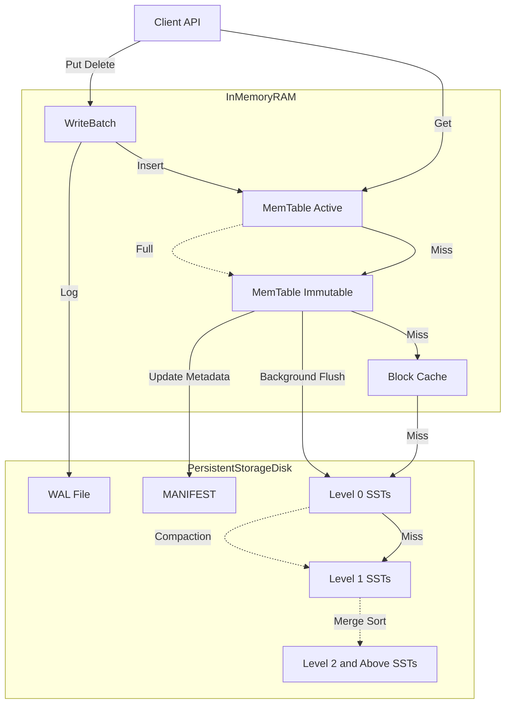

# Master Design Specification: Lithos (v1.0)

| Meta Field | Value |
| --- | --- |
| **Project Name** | **Lithos** |
| **Version** | **1.0.0 (Release)** |
| **Author** | Aditya (`@bit2swaz`) |
| **Status** | **PRODUCTION** |
| **Language** | **C11 (ISO/IEC 9899:2011)** |
| **Dependencies** | `libc`, `pthread` (POSIX Threads) |
| **Zero-Dependency** | **Yes** (Internal RLE Compression, Internal CRC32C) |
| **Endianness** | **Little Endian** (Strict) |
| **Concurrency** | **MVCC** (Multi-Version Concurrency Control) via Snapshots |
| **Architecture** | **LSM-Tree** (Log-Structured Merge Tree) |

---

## 1. Executive Summary

**Lithos** is a persistent, thread-safe, high-performance Key-Value storage engine embedded as a C library. It is architected to provide strict resource control and ACID guarantees without the runtime overhead of C++. It implements a classic Log-Structured Merge-Tree (LSM) design with Leveled Compaction, Write-Ahead Logging (WAL), and native compression.

### 1.1 Verified Capabilities (v1.0)

* **High Throughput:** CLI `bench` (50k ops, 512B values) on dev hardware reports ~73k writes/sec and ~97k reads/sec.
* **Snapshot Isolation:** Supports point-in-time reads via `Lithos_GetSnapshot`.
* **Crash Consistency:** Automatic WAL replay on startup recovers un-flushed MemTable data.
* **Storage Efficiency:** Native Run-Length Encoding (RLE) and Prefix Compression minimize disk footprint.
* **Maintenance:** Background compaction automatically merges and cleans up SSTables (Leveled Strategy).

---

## 2. System Architecture

The engine functions as a **pipelined state machine**. Data flows from volatile RAM buffers to immutable disk files through a series of transformations.

### 2.1 Data Flow Diagram



### 2.2 Component Hierarchy

* **Frontend (API Layer):** `lithos.h` exposes opaque handles and thread-safe entry points.
* **Version Controller (`VersionSet`):** Manages the "current state" of the database (live SST files per level). Handles RefCounting for MVCC.
* **Write Path:**
* `WriteBatch`: atomic group of updates.
* `LogWriter`: Appends to `wal.log`.
* `MemTable`: Inserts into in-memory SkipList.


* **Read Path:**
* `MemTable` (Active)  `MemTable` (Immutable)  `TableCache` (SSTs).
* Uses a **Two-Level Iterator** (Index Block  Data Block) for disk lookups.


* **Maintenance:**
* `Compaction`: Merges overlapping L0 files into L1 (and so on).
* `TableBuilder`: Generates new SST files with Bloom Filters and RLE compression.


---

## 3. Core Subsystems & Data Structures

### 3.1 Memory Management: The Arena

To prevent memory fragmentation and syscall overhead, Lithos avoids `malloc` for individual SkipList nodes.

* **Mechanism:** Allocates memory in 4KB "Blocks".
* **Allocation:** Bump-pointer allocation within the current block.
* **Lifecycle:** The entire Arena is freed only when its owner (MemTable) is flushed and destroyed.
* **Alignment:** Enforces 8-byte alignment for all pointers.

### 3.2 The MemTable (SkipList)

* **Structure:** Multilevel Linked List (Skip List) with probabilistic height.
* **Concurrency:**
* **Writes:** Serialized via `db_mutex`.
* **Reads:** Lock-free traversal using `atomic_load` (memory_order_acquire).


* **Key Format:**
* **InternalKey:** `UserKey` + `SequenceNumber` (7 bytes) + `ValueType` (1 byte).
* **Comparator:** Sorts by UserKey (Ascending)  SequenceNumber (Descending). This ensures the newest version of a key appears first.


### 3.3 The VersionSet (MVCC & Metadata)

* **Manifest:** A log file (`MANIFEST-XXXXXX`) stores `VersionEdit` records.
* **VersionEdit:** Describes a delta transition (e.g., "Delete File 4 from L0, Add File 5 to L1").
* **Snapshot Logic:**
* `Lithos_GetSnapshot` captures the current `LastSequence`.
* `Compaction` prevents deletion of overwritten keys if their sequence number is visible to an active snapshot.


---

## 4. Disk Format Specifications

All integers are **Little Endian**.
**Varint64:** Variable-length integers (Protobuf style) are used for lengths to save space.

### 4.1 Write-Ahead Log (WAL)

A sequence of 32KB blocks. Records are fragmented if they cross block boundaries.

**Record Format:**

```text
[Checksum (4B)] [Length (2B)] [Type (1B)] [Payload (N Bytes)]

```

* `Checksum`: CRC32C of Type + Payload.
* `Type`: `kFullType`, `kFirstType`, `kMiddleType`, `kLastType`.

### 4.2 SSTable (Sorted String Table) v1

Immutable file format for persistent storage. Based on the LevelDB/RocksDB Block-Based format.

**File Layout:**

```text
[Data Block 0]
[Data Block 1]
...
[Filter Block]     (Bloom Filter data)
[Meta Index Block] (Points to Filter Block)
[Index Block]      (Maps Key Ranges -> Data Block Offsets)
[Footer]           (Fixed 48 bytes)

```

**A. Data Block Format (Prefix Compressed):**
Keys are compressed relative to the previous key.

```text
[SharedLen (Varint)] [NonSharedLen (Varint)] [ValLen (Varint)] [KeySuffix] [Value]

```

**B. Block Compression (RLE):**

* **Algorithm:** Run-Length Encoding.
* **Trigger:** Controlled by `options.compression_enabled`.
* **Storage:** The block trailer contains a `Type` byte (`0` = Raw, `1` = RLE). The reader checks this byte to decide whether to uncompress.

**C. Footer (Fixed 48 Bytes):**
Located at `FileSize - 48`. Allows boot-strapping the file read.

```c
struct Footer {
    BlockHandle metaindex_handle; // Offset + Size
    BlockHandle index_handle;     // Offset + Size
    char padding[...];            // To align to 40 bytes
    uint64_t magic_number;        // 0xdb4775248b80fb57
};

```

---

## 5. Subsystem Logic

### 5.1 Compaction (Leveled)

The heart of the LSM tree. Keeps read speeds fast by removing deleted data and merging files.

**Levels:**

* **L0:** Created by MemTable Flush. Keys **can** overlap between files.
* **L1 - L6:** Keys **cannot** overlap. Sorted disjoint ranges.

**The Algorithm (`DoCompactionWork`):**

1. **Trigger:**
* L0 score: `NumFiles / 4` > 1.0
* L1+ score: `TotalBytes / Limit` > 1.0


2. **Pick:** Select file(s) from Level `N` and overlapping files from Level `N+1`.
3. **Merge:**
* Open `MergingIterator` (K-Way Merge Sort).
* Iterate through keys.
* **Drop Rule:** Discard key IF (`Type == kTypeDeletion` AND Key not in higher levels) OR (`Sequence < SmallestSnapshot` AND overwritten).


4. **Output:** Write to new SSTable(s).
5. **Commit:** Atomic `LogAndApply` to `VersionSet`.

### 5.2 Table Cache & Block Cache

* **Table Cache:** An LRU cache of open file descriptors (`Lithos_Table*`). Limits the OS file handle usage (default: 1000).
* **Block Cache:** An LRU cache of uncompressed data blocks (`4KB`).
* **Sharding:** Split into 16 shards based on `Hash(Key)` to reduce mutex contention.
* **Lookup Key:** `CacheID (8B) + Offset (8B)`.


### 5.3 Bloom Filters

* **Policy:** Double-Hashing.
* **Storage:** Stored in a separate block at the end of the SST file.
* **Usage:** Before reading a Data Block, the reader checks the Bloom Filter. If the filter returns `false`, disk I/O is skipped completely.

---

## 6. Public API Specification (`lithos.h`)

Current public header shape:

```c
#ifndef LITHOS_H
#define LITHOS_H

#include <stddef.h>
#include <stdbool.h>
#include "lithos/options.h"
#include "lithos/db.h"
#include "util/status.h"
#include "util/slice.h"

#ifdef __cplusplus
extern "C" {
#endif

typedef struct Lithos_DB Lithos_DB;
typedef struct Lithos_Snapshot Lithos_Snapshot;

typedef void (*Lithos_ScanCallback)(const char* key, const char* value, void* arg);

Status Lithos_Open(const char* dbpath, const Lithos_Options* options, Lithos_DB** db_out);
Status Lithos_Put(Lithos_DB* db, const char* key, const char* value);
Status Lithos_Get(Lithos_DB* db, const char* key, const Lithos_Snapshot* snapshot, char** value_out);
const Lithos_Snapshot* Lithos_GetSnapshot(Lithos_DB* db);
void Lithos_ReleaseSnapshot(Lithos_DB* db, const Lithos_Snapshot* snapshot);
Status Lithos_Delete(Lithos_DB* db, const char* key);
Status Lithos_Scan(Lithos_DB* db, Lithos_ScanCallback cb, void* arg);
void Lithos_Close(Lithos_DB* db);
void Lithos_Free(void* ptr);

#ifdef __cplusplus
}
#endif

#endif /* LITHOS_H */

```

`Lithos_Options` (from `include/lithos/options.h`):

```c
typedef struct Lithos_Options {
    size_t block_restart_interval;
    size_t block_size;
    const Comparator* comparator;
    const Lithos_FilterPolicy* filter_policy;
    Lithos_Cache* block_cache;
    bool compression_enabled;
} Lithos_Options;
```

Initialize with `Lithos_Options_InitDefault(&opt);` before opening a DB.

---

## 7. Tooling & CLI

Lithos includes a robust CLI tool for administration and benchmarking.

### 7.1 `lithos_cli`

Usage: `./lithos_cli <db_path> <command> [args]`

| Command | Args | Description |
| --- | --- | --- |
| `put` | `<key> <val>` | Insert a key-value pair. |
| `get` | `<key>` | Retrieve and print a value. |
| `del` | `<key>` | Delete a key. |
| `scan` | *(none)* | Print all keys (Ascending). |
| `fill` | `<count> <size>` | Bulk load deterministic keys with random values. |
| `bench` | `<count> <size>` | Run write/read benchmarks and print ops/sec/MBps. |

### 7.2 `lithos_stress`

Standalone C binary that performs a "Gauntlet" test suite:

1. **Saturation:** Writes ~20k keys to trigger compaction.
2. **Isolation:** Snapshot sees pre-overwrite values; live view sees updates/deletes.
3. **Persistence:** Reopen and sample keys to confirm durability.
4. **Tombstones:** Bulk delete a range, reopen, and confirm absence via gets and scan.

---

## 8. Build System

* **Build Tool:** GNU Make
* **Targets:**
* `make all`: Builds library, tests, CLI, and stress.
* `make test`: Runs unit tests (`lithos_test_main`).
* `make stress`: Builds the stress tool.
* `make help`: Prints target help.
* `make clean`: Removes artifacts.


* **Output:**
* Library: `build/liblithos.a`
* Binaries: `build/bin/lithos_cli`, `build/bin/lithos_stress`


---

## 9. Verification Strategy (Passed)

The following tests must pass before any release:

1. **Unit Tests:** 23,800+ assertions in `lithos_test_main` (covering WAL, SkipList, Bloom, Cache).
2. **Leak Check:** `valgrind --leak-check=full` must report **0 bytes lost**.
3. **Gauntlet:** `lithos_stress` must pass all 4 stages (Saturation, Isolation, Persistence, Tombstones).
4. **Benchmark:** `lithos_cli bench` must demonstrate >30k ops/sec.