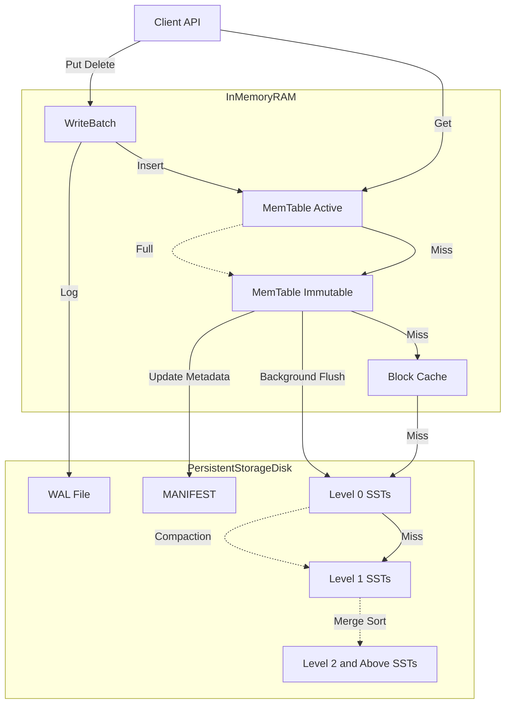

# product spec: lithos (v1.0)

| meta | value |
| --- | --- |
| project | lithos |
| version | 1.0.0 |
| author | aditya (`@bit2swaz`) |
| status | production |
| language | c11 (iso/iec 9899:2011) |
| dependencies | `libc`, `pthread` (posix threads) |
| zero-dependency | yes (internal rle compression, internal crc32c) |
| endianness | little endian (strict) |
| concurrency | mvcc via snapshots |
| architecture | lsm-tree |

---

## 1. executive summary

**lithos** is a persistent, thread-safe, high-performance key-value storage engine embedded as a c library. it is built for strict resource control and acid guarantees without the runtime overhead of c++. it implements a classic log-structured merge-tree with leveled compaction, write-ahead logging (wal), and native compression.

### 1.1 verified capabilities (v1.0)

- high throughput: cli `bench` (50k ops, 512b values) on dev hardware reports ~73k writes/sec and ~97k reads/sec.
- snapshot isolation: supports point-in-time reads via `lithos_getsnapshot`.
- crash consistency: automatic wal replay on startup recovers un-flushed memtable data.
- storage efficiency: native run-length encoding (rle) and prefix compression minimize disk footprint.
- maintenance: background compaction automatically merges and cleans up sstables (leveled strategy).
- corruption detection: sst block crc32c is verified on read; checksum mismatches surface as `lithos_corruption`.
- sanitizer cleanliness: asan/ubsan builds run `lithos_stress` and `lithos_fuzz` leak-free while still detecting injected sst corruption.
- sequence recovery: on db open, `max_sequence` is recovered from sst file metadata to prevent sequence number reuse after restart.

---

## 2. system architecture

the engine functions as a pipelined state machine. data flows from volatile ram buffers to immutable disk files through a series of transformations.

### 2.1 data flow diagram



### 2.2 component hierarchy

* frontend (api layer): `lithos.h` exposes opaque handles and thread-safe entry points.
* version controller (`versionset`): manages the current state of the database (live sst files per level). handles refcounting for mvcc.
* write path:
* `writebatch`: atomic group of updates.
* `logwriter`: appends to `wal.log`.
* `memtable`: inserts into in-memory skiplist.


* read path:
* `memtable` (active)  `memtable` (immutable)  `tablecache` (ssts).
* uses a two-level iterator (index block  data block) for disk lookups.


* maintenance:
* `compaction`: merges overlapping l0 files into l1 (and so on).
* `tablebuilder`: generates new sst files with bloom filters and rle compression.


---

## 3. core subsystems and data structures

### 3.1 memory management: the arena

to prevent memory fragmentation and syscall overhead, lithos avoids `malloc` for individual skiplist nodes.

* mechanism: allocates memory in 4kb blocks.
* allocation: bump-pointer allocation within the current block.
* lifecycle: the entire arena is freed only when its owner (memtable) is flushed and destroyed; background flushes drop both worker and db refs to release arenas promptly.
* alignment: enforces 8-byte alignment for all pointers.

### 3.2 the memtable (skiplist)

* structure: multilevel linked list (skip list) with probabilistic height.
* concurrency:
* writes: serialized via `db_mutex`.
* reads: lock-free traversal using `atomic_load` (memory_order_acquire).


* key format:
* internalkey: `userkey` + `sequencenumber` (7 bytes) + `valuetype` (1 byte).
* comparator: sorts by userkey (ascending)  sequencenumber (descending). this ensures the newest version of a key appears first.


### 3.3 the versionset (mvcc and metadata)

* manifest: a log file (`manifest-XXXXXX`) stores `versionedit` records.
* versionedit: describes a delta transition (e.g., delete file 4 from l0, add file 5 to l1).* `filemetadata`: stores file number, size, key range (smallest/largest), and `max_sequence` for recovery.* snapshot logic:
* `lithos_getsnapshot` captures the current `lastsequence`.
* `compaction` prevents deletion of overwritten keys if their sequence number is visible to an active snapshot.


---

## 4. disk format specifications

all integers are little endian. varint64 (protobuf style) is used for lengths to save space.

### 4.1 write-ahead log (wal)

sequence of 32kb blocks. records are fragmented if they cross block boundaries.

record format:

```text
[Checksum (4B)] [Length (2B)] [Type (1B)] [Payload (N Bytes)]

```

- checksum: crc32c of type + payload.
- type: `kfulltype`, `kfirsttype`, `kmiddletype`, `klasttype`.

### 4.2 sstable (sorted string table) v1

immutable file format for persistent storage. based on the leveldb/rocksdb block-based format.

file layout:

```text
[Data Block 0]
[Data Block 1]
...
[Filter Block]     (Bloom Filter data)
[Meta Index Block] (Points to Filter Block)
[Index Block]      (Maps Key Ranges -> Data Block Offsets)
[Footer]           (Fixed 48 bytes)

```

**a. data block format (prefix compressed):**
keys are compressed relative to the previous key.

```text
[SharedLen (Varint)] [NonSharedLen (Varint)] [ValLen (Varint)] [KeySuffix] [Value]

```

**b. block compression (rle):**

* algorithm: run-length encoding.
* trigger: controlled by `options.compression_enabled`.
* storage: the block trailer contains a `type` byte (`0` = raw, `1` = rle). the reader checks this byte to decide whether to uncompress.

**c. footer (fixed 48 bytes):**
located at `filesize - 48`. allows boot-strapping the file read.

```c
struct Footer {
    BlockHandle metaindex_handle; // Offset + Size
    BlockHandle index_handle;     // Offset + Size
    char padding[...];            // To align to 40 bytes
    uint64_t magic_number;        // 0xdb4775248b80fb57
};

```

---

## 5. subsystem logic

### 5.1 compaction (leveled)

core of the lsm tree. keeps read speeds fast by removing deleted data and merging files.

levels:

- l0: created by memtable flush. keys can overlap between files.
- l1 - l6: keys cannot overlap. sorted disjoint ranges.

the algorithm (`docompactionwork`):

1. trigger:
- l0 score: `numfiles / 4` > 1.0
- l1+ score: `totalbytes / limit` > 1.0


2. pick: select file(s) from level `n` and overlapping files from level `n+1`.
3. merge:
- open `mergingiterator` (k-way merge sort).
- iterate through keys.
- drop rule: discard key if (`type == ktypedeletion` and key not in higher levels) or (`sequence < smallestsnapshot` and overwritten).
- ownership: the merging iterator owns its children; callers must not destroy children separately.


4. output: write to new sstable(s).
5. commit: atomic `logandapply` to `versionset`.

### 5.2 table cache and block cache

* table cache: an lru cache of open file descriptors (`lithos_table*`). limits os file handle usage (default: 1000).
* block cache: an lru cache of uncompressed data blocks (`4kb`).
* sharding: split into 16 shards based on `hash(key)` to reduce mutex contention.
* lookup key: `cacheid (8b) + offset (8b)`.


### 5.3 bloom filters

* policy: double-hashing.
* storage: stored in a separate block at the end of the sst file.
* usage: before reading a data block, the reader checks the bloom filter. if the filter returns `false`, disk i/o is skipped completely.

---

## 6. public api specification (`lithos.h`)

current public header shape:

```c
#ifndef LITHOS_H
#define LITHOS_H

#include <stddef.h>
#include <stdbool.h>
#include "lithos/options.h"
#include "lithos/db.h"
#include "util/status.h"
#include "util/slice.h"

#ifdef __cplusplus
extern "C" {
#endif

typedef struct Lithos_DB Lithos_DB;
typedef struct Lithos_Snapshot Lithos_Snapshot;

typedef void (*Lithos_ScanCallback)(const char* key, const char* value, void* arg);

Status Lithos_Open(const char* dbpath, const Lithos_Options* options, Lithos_DB** db_out);
Status Lithos_Put(Lithos_DB* db, const char* key, const char* value);
Status Lithos_Get(Lithos_DB* db, const char* key, const Lithos_Snapshot* snapshot, char** value_out);
const Lithos_Snapshot* Lithos_GetSnapshot(Lithos_DB* db);
void Lithos_ReleaseSnapshot(Lithos_DB* db, const Lithos_Snapshot* snapshot);
Status Lithos_Delete(Lithos_DB* db, const char* key);
Status Lithos_Scan(Lithos_DB* db, Lithos_ScanCallback cb, void* arg);
void Lithos_Close(Lithos_DB* db);
void Lithos_Free(void* ptr);

#ifdef __cplusplus
}
#endif

#endif /* LITHOS_H */

```

`lithos_options` (from `include/lithos/options.h`):

```c
typedef struct Lithos_Options {
    size_t block_restart_interval;
    size_t block_size;
    const Comparator* comparator;
    const Lithos_FilterPolicy* filter_policy;
    Lithos_Cache* block_cache;
    bool compression_enabled;
} Lithos_Options;
```

initialize with `lithos_options_initdefault(&opt);` before opening a db.

---

## 7. tooling and cli

lithos includes a robust cli tool for administration and benchmarking.

### 7.1 `lithos_cli`

usage: `./lithos_cli <db_path> <command> [args]`

| command | args | description |
| --- | --- | --- |
| `put` | `<key> <val>` | Insert a key-value pair. |
| `get` | `<key>` | Retrieve and print a value. |
| `del` | `<key>` | Delete a key. |
| `scan` | *(none)* | Print all keys (Ascending). |
| `fill` | `<count> <size>` | Bulk load deterministic keys with random values. |
| `bench` | `<count> <size>` | Run write/read benchmarks and print ops/sec/MBps. |

### 7.2 `lithos_stress`

standalone c binary that performs a gauntlet test suite:

1. **Saturation:** Writes ~20k keys to trigger compaction.
2. **Isolation:** Snapshot sees pre-overwrite values; live view sees updates/deletes.
3. **Persistence:** Reopen and sample keys to confirm durability.
4. **Tombstones:** Bulk delete a range, reopen, and confirm absence via gets and scan.

### 7.3 `lithos_fuzz`

corruption-injection harness that flips a random bit inside a freshly written sst:

1. Write key `integrity_test`, close DB to flush to SST.
2. Open the newest `.sst`, flip a random bit in the file.
3. Reopen DB and issue `Get("integrity_test")`.
4. Expect `LITHOS_CORRUPTION`/`LITHOS_IO_ERROR` (no crashes).

---

## 8. build system

* build tool: gnu make
* targets:
* `make all`: builds library, tests, cli, stress, fuzz.
* `make test`: runs unit tests (`lithos_test_main`).
* `make stress`: builds the stress tool.
* `make fuzz`: builds the corruption harness.
* `make sanitize`: rebuilds with `-fsanitize=address -fsanitize=undefined -fno-omit-frame-pointer`.
* `make help`: prints target help.
* `make clean`: removes artifacts.


* output:
* library: `build/liblithos.a`
* binaries: `build/bin/lithos_cli`, `build/bin/lithos_stress`, `build/bin/lithos_fuzz`


---

## 9. verification strategy (passed)

the following tests must pass before any release:

1. unit tests: 23,800+ assertions in `lithos_test_main` (covering wal, skiplist, bloom, cache).
2. leak check: `valgrind --leak-check=full` must report 0 bytes lost.
3. gauntlet: `lithos_stress` must pass all 4 stages (saturation, isolation, persistence, tombstones).
4. benchmark: `lithos_cli bench` must demonstrate >30k ops/sec.

### 9.1 sanitizer qa (asan/ubsan)

run on fresh builds to guarantee leak/ub freedom while still surfacing corruption:

```
make sanitize -j$(nproc)

rm -rf /tmp/lithos-sanitize-stress && ./build/bin/lithos_stress /tmp/lithos-sanitize-stress
# Expect: Gauntlet passes, no sanitizer output.

rm -rf /tmp/lithos-fuzz-db && ./build/bin/lithos_fuzz /tmp/lithos-fuzz-db
# Expect: corruption message (flipped SST) and clean ASan/UBSan exit with zero leaks.
```

notes: imm memtable flush now drops both worker and db refs; filemetadata created during flush is released on both success and failure, keeping leak detectors clean.

### 9.2 recent bug fixes

the following issues were identified and resolved:

1. **sequence number recovery**: `filemetadata` now stores `max_sequence` (highest sequence number in file). on db open, the engine scans all sst files and restores `last_sequence` to prevent reusing sequence numbers after restart.

2. **double-free in compaction**: `docompactionwork` previously destroyed merge iterator children after the merge iterator itself had already freed them. fixed by removing redundant child destruction.

3. **memory leaks in db close**:
   - iterator leak: `writelevel0table` now destroys the memtable iterator on empty-table early return.
   - memtable ref leak: `compactmemtable` now properly unrefs both the local reference and the db->imm reference before clearing the pointer.

4. **test internal key format**: unit tests now use proper internal keys (user key + 8-byte sequence/type trailer) when calling `tablebuilder_add` and iterator seeks.